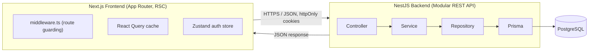
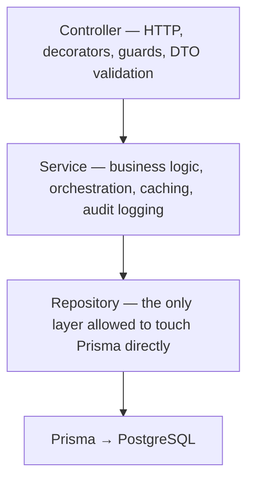

# Inventory & ERP Management System

A full-stack, multi-module ERP system for managing suppliers, purchasing, sales, invoicing, payments, and stock — built as a production-style monorepo with a **NestJS** backend and a **Next.js 16** frontend.

---

## 1. Tech Stack

### Backend

| Layer        | Technology                                                                      |
| ------------ | ------------------------------------------------------------------------------- |
| Framework    | NestJS 11 (Express platform)                                                    |
| Language     | TypeScript                                                                      |
| Database     | PostgreSQL                                                                      |
| ORM          | Prisma 7 (with `@prisma/adapter-pg` driver adapter)                             |
| Auth         | JWT (access + refresh tokens), Passport.js                                      |
| Validation   | `class-validator` / `class-transformer`                                         |
| Security     | Helmet, CORS allow-list, rate limiting (`@nestjs/throttler`), HTML sanitization |
| Docs         | Swagger (`@nestjs/swagger`)                                                     |
| Mail         | Nodemailer                                                                      |
| File uploads | Multer                                                                          |

### Frontend

| Layer                 | Technology                        |
| --------------------- | --------------------------------- |
| Framework             | Next.js 16 (App Router, React 19) |
| Language              | TypeScript                        |
| Data fetching / cache | TanStack React Query              |
| State management      | Zustand                           |
| Forms & validation    | React Hook Form + Zod             |
| HTTP client           | Axios (with interceptors)         |
| Styling               | Tailwind CSS 4                    |
| Charts                | Recharts                          |
| Icons                 | Lucide React                      |

---

## 2. High-Level Architecture



The backend follows a strict **layered architecture** per domain module:



Every business domain (Suppliers, Purchase Orders, Sales Orders, Customers, Products, Invoices, Payments, Stock Movements, Reports, Users, Audit Log, Company Settings, Content Pages, Dashboard) is its own **NestJS module**, each with its own controller/service/repository/DTOs — keeping the codebase scalable and independently testable.

---

## 3. Data Flow (Request Lifecycle Example — Creating a Sales Order)

1. **Frontend** — a React Hook Form (validated client-side with Zod) submits to `lib/api/sales-orders.api.ts`, which calls the shared `apiClient` (Axios instance with `withCredentials: true`).
2. **Middleware (`middleware.ts`)** already gated the page itself — before the user could even reach the Sales Orders screen, Next.js middleware checked for a valid session cookie and decoded the JWT's role client-side to confirm the route is allowed for that role.
3. **Request hits NestJS** → global `helmet` + CORS allow-list checks → `ThrottlerGuard` (rate limit) → `JwtAuthGuard` (validates the JWT from the httpOnly cookie via Passport) → `RolesGuard` (checks `@Roles(...)` metadata against the authenticated user).
4. **`ValidationPipe`** (global, `whitelist: true`) strips unknown fields and validates the DTO; any free-text field marked with the custom `@Sanitize()` decorator is stripped of HTML tags before it ever reaches the service layer.
5. **`SalesOrdersController`** delegates to `SalesOrdersService`, which runs the actual business rules (stock availability, price calculation, status transitions) inside a Prisma transaction via `SalesOrdersRepository`.
6. On success, the service writes an **audit log entry** (who did what, when, before/after) and invalidates any related cache keys (e.g. dashboard, reports).
7. **`ResponseInterceptor`** wraps the result in a consistent `{ success, data }` envelope; **`LoggingInterceptor`** logs the request; **`HttpExceptionFilter`** normalizes any thrown error into a consistent error shape.
8. **Frontend** receives the response, React Query updates its cache and re-renders the relevant lists/tables — no manual refetch wiring needed.

---

## 4. Authentication & Security

This system does **not** use `localStorage` tokens — it's built around **httpOnly cookies**, which by design cannot be read or tampered with by JavaScript, closing off the most common XSS-token-theft vector.

### 4.1 Token model

- **Access token** — short-lived JWT (15 min), signed with `JWT_SECRET`, stored in an `httpOnly`, `sameSite=lax` cookie (`access_token`).
- **Refresh token** — long-lived (7 days) opaque random token. Only its **hash** (SHA-256) is stored in the database via the `RefreshToken` model — the raw token itself is never persisted, so a database leak alone can't be used to forge sessions.
- Both cookies use `secure: true` in production and are scoped to `path: '/'` so Next.js middleware can see them on every navigation.

### 4.2 Refresh token rotation & theft detection

- Every time a refresh token is used, it is **immediately revoked** and replaced with a brand-new one (rotation).
- If a client ever presents a token that's already been rotated/revoked, that's a strong signal of token theft (replay attack) — a legitimate flow would never do this.
- `changePassword` calls `revokeAllRefreshTokensForUser`, forcing every other logged-in device/session to re-authenticate immediately.

### 4.3 Authorization

- **`JwtAuthGuard`** (Passport strategy) extracts and verifies the JWT from the cookie, then re-checks the user still exists and is active in the DB on every request (so disabling a user takes effect instantly, not just at token expiry).
- **`RolesGuard`** + `@Roles('ADMIN', 'MANAGER', ...)` decorator provide fine-grained, per-route Role-Based Access Control (RBAC), enforced _after_ authentication.
- Route-level protection is mirrored on the frontend via `middleware.ts`, which maps URL patterns to allowed roles (`route-rules.ts`) and redirects unauthorized users before the page even renders — defense in depth (backend is still the real authority).

### 4.4 Defense-in-depth hardening

- **Helmet** sets secure HTTP headers (CSP-related headers, `X-Content-Type-Options`, etc.) on every response.
- **Strict CORS allow-list** — only the configured frontend origin(s) can make credentialed requests; anything else is rejected at the origin-check callback.
- **Rate limiting** — a global `ThrottlerGuard` caps every route at 100 requests/minute by default, with a stricter, dedicated limit on the login endpoint to blunt brute-force attempts.
- **Input sanitization** — a reusable `@Sanitize()` property decorator strips HTML tags from any free-text DTO field (notes, addresses, descriptions) before it's persisted, preventing stored XSS even in Rich-Text-Editor-driven content like the admin-editable Help/Privacy/Terms pages.
- **Password security** — bcrypt hashing (10 salt rounds) for both login passwords and stored refresh-token hashes.
- **Global validation pipe** — `whitelist: true` silently drops any field not declared in a DTO, closing off mass-assignment style attacks.
- **Audit Log module** — every sensitive mutation (create/update/delete, stock adjustments, settings changes) is recorded with actor, action, entity, and timestamp for traceability and compliance.

---

## 5. Caching Strategy

Rather than pulling in Redis for a single-instance deployment, the system ships a small, dependency-free **in-memory TTL cache** (`CacheService`) exposed as a **global NestJS provider**, so any module can inject and use it without extra imports.

```ts
class CacheService {
  get<T>(key): T | undefined;
  set<T>(key, value, ttlMs): void;
  getOrSet<T>(key, ttlMs, loader): Promise<T>; // cache-aside pattern
  invalidate(key): void;
  invalidatePrefix(prefix): void; // bulk-clear a whole namespace
}
```

**Cache-aside pattern in practice** — read-heavy, aggregation-style endpoints (Dashboard overview, Reports summary/sales/purchases/inventory/payments) call `cache.getOrSet(key, ttl, () => expensiveQuery())`: the first request computes and stores the result, every subsequent request within the TTL window is served straight from memory with zero database round-trips.

**Centralized keys & TTLs** (`cache-keys.constants.ts`) — every prefix and TTL lives in one file, so the modules that _write_ data (Products, Categories, Suppliers, Customers) and the modules that _read_ aggregated data (Reports, Dashboard) always agree on exactly what to invalidate:

| Data                                                     | TTL   | Rationale                                             |
| -------------------------------------------------------- | ----- | ----------------------------------------------------- |
| Dashboard overview                                       | 1 min | Near-real-time operational numbers                    |
| List endpoints (products/categories/suppliers/customers) | 1 min | Frequently browsed, cheap to refresh                  |
| Reports (sales/purchases/inventory/payments)             | 5 min | Heavier aggregate queries — safe to be slightly stale |

The design is intentionally **swap-friendly**: because every module talks to the cache through the same `CacheService` interface, moving to a shared Redis-backed store for horizontal scaling later is a one-file change, not a rewrite.

On the **frontend**, TanStack React Query provides a second caching layer — deduping in-flight requests, keeping server data fresh in the background, and giving instant UI feedback via optimistic cache updates without extra boilerplate.

---

## 6. Key Features

- **Full purchase-to-pay & order-to-cash cycles**: Suppliers → Purchase Orders → Stock Movements → Sales Orders → Invoices → Payments, all linked and status-tracked (`PENDING`, `APPROVED`, `PAID`, etc.).
- **Manual stock adjustments** with signed quantities, mandatory notes, floor-quantity validation, and automatic audit logging.
- **Dashboard** with live KPIs, recent activity tables, and stock-movement widgets.
- **Reporting suite** — Sales, Purchases, Inventory, and Payments reports with date-range filters, RTL-aware chart periods and Arabic numeral formatting, plus **PDF and Excel export** straight from the Reports page.
- **Full internationalization (i18n)** — English and Arabic kept in sync, with complete RTL layout support across the entire dashboard.
- **Admin-editable static content pages** (Help, Privacy, Terms, Support, Team) via an in-app Rich Text Editor, with HTML sanitized server-side before storage.
- **Role-based navigation** — the sidebar, actions, and API access all respect a shared `canManage`-style permission pattern per role.
- **Printable invoices** with a dedicated print-optimized layout.
- **Audit Log viewer** with translated action/entity labels for non-technical staff.
- **Light/dark theme** and a polished, consistent white/blue design system throughout.

---

## 7. Project Structure (Backend)

```
src/
├── auth/                 # login, refresh rotation, password reset, JWT strategy
├── users/                # user CRUD, activation, roles
├── categories/ products/ # catalog
├── suppliers/ purchase-orders/
├── customers/ sales-orders/
├── invoices/ payments/
├── stock-movements/
├── reports/              # cached aggregate reporting + exports
├── dashboard/
├── company-settings/
├── content-pages/        # admin-editable static pages
└── common/
    ├── audit-log/
    ├── cache/             # CacheService, keys & TTL constants
    ├── cookies/           # httpOnly cookie helpers
    ├── decorators/        # @Roles, @CurrentUser
    ├── guards/            # JwtAuthGuard, RolesGuard
    ├── filters/           # global exception filter
    ├── interceptors/      # response envelope, logging
    ├── pipes/             # global validation
    └── utils/             # paginate(), @Sanitize()
```

## 8. Project Structure (Frontend)

```
app/
├── (auth)/                # login, forgot/reset password
└── (dashboard)/           # every protected module (products, orders, reports, settings...)
components/                # feature-organized, reusable UI components
lib/
├── api/                   # one typed API module per domain, all via a shared Axios client
├── auth/                  # auth store (Zustand), route rules, JWT role decoding
├── i18n/                  # English/Arabic translation layer
└── theme/                 # light/dark theme provider
middleware.ts               # edge-level route protection by role, before page render
```

---

## 9. Summary

This project demonstrates an end-to-end, production-minded ERP build: a **modular, layered NestJS backend** with real security engineering (rotating refresh tokens, RBAC, sanitized input, rate limiting), a **dependency-free but well-designed caching layer** for expensive aggregate queries, and a **fully bilingual, RTL-ready Next.js frontend** with role-aware routing and a polished, consistent design system — covering the complete business flow from procurement to sales to reporting.
