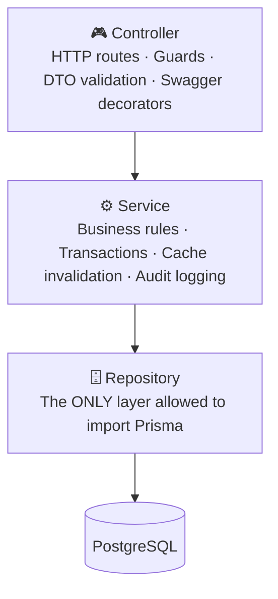
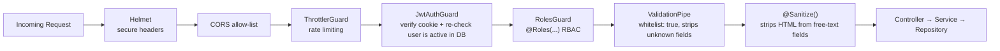
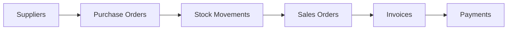

# ERP Lite — Backend API


**A production-style, modular REST API for a full ERP: suppliers → purchasing → stock → sales → invoicing → payments — with real security engineering behind it, not a tutorial project.**

---

## Why this backend is built the way it is

Most portfolio APIs stop at "CRUD + JWT." This one is built the way a backend for a real company would be: every domain is isolated into its own module, every layer has one job, every sensitive action is auditable, and every request goes through the same hardened pipeline before it touches business logic.

---

## 🏗️ Architecture — Strict Layered Design

Every one of the 14 business modules (Suppliers, Products, Categories, Purchase Orders, Sales Orders, Customers, Invoices, Payments, Stock Movements, Reports, Dashboard, Users, Company Settings, Content Pages) follows the **exact same three-layer contract** — no exceptions, no shortcuts:



**Why this matters:** the Controller never knows Prisma exists. The Service never writes raw SQL. If the database ever needs to change, only the Repository layer moves. This is the same discipline used in enterprise .NET/Spring codebases, applied to NestJS.

```
src/
├── auth/                 # Login, refresh rotation, password reset, Passport JWT strategy
├── users/                # User CRUD, activation/deactivation, role assignment
├── categories/ products/ # Product catalog
├── suppliers/ purchase-orders/
├── customers/ sales-orders/
├── invoices/ payments/
├── stock-movements/      # Signed-quantity adjustments with audit trail
├── reports/              # Cached aggregate reporting + PDF/Excel export
├── dashboard/            # Live KPIs
├── company-settings/     # Logo, currency, invoice numbering
├── content-pages/        # Admin-editable Help/Privacy/Terms via sanitized rich text
└── common/
    ├── audit-log/        # Who did what, when, before/after
    ├── cache/             # In-memory TTL cache — CacheService
    ├── cookies/           # httpOnly cookie helpers
    ├── decorators/        # @Roles(), @CurrentUser()
    ├── guards/            # JwtAuthGuard, RolesGuard
    ├── filters/           # Global exception → consistent error shape
    ├── interceptors/       # Response envelope, request logging
    ├── pipes/             # Global ValidationPipe (whitelist: true)
    └── utils/             # paginate(), @Sanitize()
```

---

## 🔐 Security — Built like it's going to production

This is the part I'm proudest of. Nothing here is decorative — every mechanism below solves a real attack vector.

### Token model: no `localStorage`, ever

| Token             | Lifetime | Storage                                                        | Why                                                          |
| ----------------- | -------- | -------------------------------------------------------------- | ------------------------------------------------------------ |
| **Access token**  | 15 min   | `httpOnly`, `sameSite=lax` cookie                              | Invisible to JavaScript → immune to XSS token theft          |
| **Refresh token** | 7 days   | Opaque random value; only its **SHA-256 hash** lives in the DB | A leaked database alone can never be used to forge a session |

### Rotation + theft detection

On every refresh, the old token is **immediately revoked** and replaced. If a client ever presents an already-rotated token, that's a replay attack signature — a real client would never do that, so it's treated as a compromise signal. Changing a password calls `revokeAllRefreshTokensForUser`, instantly kicking every other active session.

### Request pipeline (every single request passes through all of this, in order)



- **Helmet** — secure headers (CSP-related, `X-Content-Type-Options`, etc.) on every response.
- **Strict CORS allow-list** — only the configured frontend origin can send credentialed requests.
- **Rate limiting (`@nestjs/throttler`)** — 100 req/min globally, with a much stricter dedicated limit on `/auth/login` to blunt brute-force attempts.
- **RBAC (`RolesGuard` + `@Roles(...)`)** — fine-grained per-route access control, checked _after_ authentication, not instead of it.
- **Live user re-check** — `JwtAuthGuard` re-verifies the user still exists and is active on _every single request_, so deactivating a user takes effect immediately — not when their token happens to expire.
- **Input sanitization** — a reusable `@Sanitize()` decorator strips HTML from any free-text DTO field (notes, addresses, rich-text content pages), preventing stored XSS even in admin-editable content.
- **Password security** — bcrypt (10 salt rounds) for both login passwords and refresh-token hashes.
- **Mass-assignment protection** — the global `ValidationPipe` with `whitelist: true` silently drops any field not explicitly declared in a DTO.
- **Audit Log** — every sensitive mutation (create/update/delete, stock adjustments, settings changes) is recorded with actor, action, entity, and before/after diff.

---

## ⚡ Caching — a real cache-aside layer, no Redis needed (yet)

Instead of pulling in Redis for a single-instance deployment, the backend ships a small, dependency-free **in-memory TTL cache** registered as a **global NestJS provider**, so any module can inject it with zero extra setup.

```ts
class CacheService {
  get<T>(key): T | undefined;
  set<T>(key, value, ttlMs): void;
  getOrSet<T>(key, ttlMs, loader): Promise<T>; // cache-aside pattern
  invalidate(key): void;
  invalidatePrefix(prefix): void; // bulk-clear a namespace
}
```

| Data                                         | TTL   | Why                                                 |
| -------------------------------------------- | ----- | --------------------------------------------------- |
| Dashboard overview                           | 1 min | Near-real-time operational numbers                  |
| Product/category/supplier/customer lists     | 1 min | Frequently browsed, cheap to refresh                |
| Reports (sales/purchases/inventory/payments) | 5 min | Heavy aggregate queries — safe to be slightly stale |

All keys and TTLs live in one file (`cache-keys.constants.ts`), so writer modules (Products, Suppliers…) and reader modules (Reports, Dashboard) always agree on exactly what to invalidate. Because every module talks to the same `CacheService` interface, swapping in Redis later for horizontal scaling is a one-file change — not a rewrite.

---

## 📦 Business Domain — the full ERP cycle



Every entity is status-tracked (`PENDING → APPROVED → PAID`, etc.), and stock adjustments require a signed quantity, a mandatory note, and floor-quantity validation — with automatic audit logging on every change.

---

## 🛠️ Tech Stack

| Layer      | Technology                                                      |
| ---------- | --------------------------------------------------------------- |
| Framework  | NestJS 11 (Express platform)                                    |
| Language   | TypeScript (strict)                                             |
| Database   | PostgreSQL                                                      |
| ORM        | Prisma 7 with `@prisma/adapter-pg` driver adapter               |
| Auth       | JWT (access + refresh) via Passport.js                          |
| Validation | `class-validator` / `class-transformer`                         |
| Security   | Helmet, CORS allow-list, `@nestjs/throttler`, HTML sanitization |
| API Docs   | Swagger (`@nestjs/swagger`)                                     |
| Mail       | Nodemailer                                                      |
| Uploads    | Multer                                                          |

---

## 🚀 Getting Started

```bash
# install
npm install

# configure environment
cp .env.example .env
# set DATABASE_URL, JWT_SECRET, FRONTEND_ORIGIN, SMTP_* ...

# run migrations
npx prisma migrate dev

# start
npm run start:dev
```

API docs available at `/api/docs` once the server is running (Swagger UI).

---

## ✅ What this project demonstrates

- Real layered architecture, enforced consistently across 14 domain modules — not just one demo module.
- Security that goes beyond "add a JWT guard": rotation, theft detection, live user re-verification, sanitization, rate limiting, RBAC.
- A caching strategy with a clear invalidation contract, designed to scale to Redis without a rewrite.
- Full audit trail for compliance-style traceability.
- Clean separation of concerns that makes the codebase testable and onboarding-friendly for new engineers.
