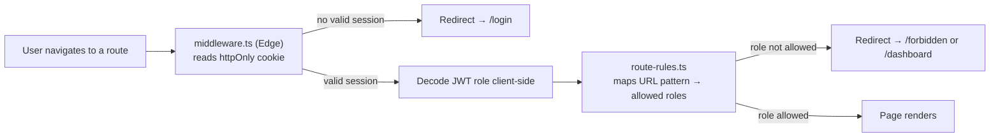

# ERP Lite — Frontend Dashboard

<p align="center">
  
  
  
  
  
  
  
</p>

<p align="center">
  <b>A fully bilingual (Arabic/English), RTL-ready ERP admin dashboard — role-aware routing, edge-level route protection, and a polished, consistent design system across every module.</b>
</p>

---

## Why this frontend stands out

This isn't a single dashboard page with some tables bolted on. It's a **role-based, internationalized, production-shaped Next.js application** covering the full business flow — suppliers, purchasing, inventory, sales, invoicing, payments, and reporting — with route protection happening at the edge, _before_ a single byte of a protected page ever reaches the browser.

---

## 🏗️ Project Structure

```
app/
├── (auth)/                # Login, forgot/reset password — public route group
└── (dashboard)/           # Every protected module: products, orders, reports, settings...
components/                # Feature-organized, reusable UI (auth/, dashboard/, invoices/, reports/, ui/...)
lib/
├── api/                   # One typed API module per domain — all through a shared Axios client
├── auth/                  # Zustand auth store, route-rules.ts, JWT role decoding
├── i18n/                  # English/Arabic translation layer
└── theme/                 # Light/dark theme provider
middleware.ts              # Edge-level route protection by role, before page render
```

Each business domain (Products, Suppliers, Purchase Orders, Sales Orders, Customers, Invoices, Payments, Stock Movements, Reports, Users, Settings) gets its **own API module, its own component folder, and its own route group** — so adding a new module never means touching unrelated code.

---

## 🛡️ Route Protection — Defense in Depth, Frontend Half



`middleware.ts` checks for a valid session cookie and decodes the JWT's role **before the page component ever executes** — so an unauthorized user never even sees a flash of a page they shouldn't. This mirrors the backend's own `RolesGuard`, giving the app real defense-in-depth: the frontend blocks early for UX, the backend is still the final authority for security.

---

## 🔄 Data Flow — Creating a Sales Order (example)

1. A React Hook Form, validated client-side with **Zod**, submits through `lib/api/sales-orders.api.ts`.
2. That call goes through the shared `apiClient` — an Axios instance configured with `withCredentials: true`, so httpOnly auth cookies are sent automatically without ever touching JavaScript.
3. On success, **TanStack React Query** updates its cache and every relevant list/table on screen re-renders — no manual refetch wiring anywhere in the app.
4. If the access token has expired mid-session, an Axios response interceptor silently calls the refresh endpoint and retries the original request — the user never sees a logout unless the refresh itself is rejected.

---

## 🌍 Internationalization & RTL — not an afterthought

- Full **Arabic/English** parity — every screen, label, and validation message is translated, not just the marketing copy.
- Complete **RTL layout support** across the entire dashboard: sidebar, tables, modals, forms, charts, and the printable invoice layout all mirror correctly.
- RTL-aware chart periods and **Arabic numeral formatting** in the Reports module.
- Careful handling of mixed-direction content (e.g. phone numbers and currency values staying LTR inside an RTL page) — a detail most bilingual dashboards get wrong.

---

## 🎨 Design System

- Consistent **white/blue flat design** with rounded inputs, applied uniformly across every module — not just the pages someone bothered to polish.
- **Light/dark theme**, backed by a dedicated `ThemeProvider`.
- A collapsible sidebar with real SVG icons and role-aware navigation — items simply don't render for roles that can't access them.
- Reusable `ui/` primitives (`Modal`, `Pagination`, `ConfirmDialog`, `SearchableSelect`, `RichTextEditor`, `LanguageSwitcher`, `ThemeToggle`) used consistently everywhere instead of one-off components per page.
- A dedicated **print-optimized invoice layout** (`PrintableInvoice.tsx`), separate from the on-screen view, so printed invoices look professional rather than being a screenshot of the UI.

---

## 📊 Key Modules

| Module                      | Highlights                                                                                             |
| --------------------------- | ------------------------------------------------------------------------------------------------------ |
| **Dashboard**               | Live KPI stat cards, recharts-based charts, recent-activity tables, stock-movement widgets             |
| **Reports**                 | Sales / Purchases / Inventory / Payments, date-range filters, **PDF & Excel export**, RTL-aware charts |
| **Invoices**                | Detail view, record-payment modal, printable layout                                                    |
| **Sales & Purchase Orders** | Line-item forms with live stock/price calculation, status badges                                       |
| **Stock Movements**         | Signed-quantity adjustment modal with mandatory notes                                                  |
| **Settings**                | Company logo upload, bilingual content-page rich-text editor                                           |
| **Users**                   | Role assignment, activation/deactivation                                                               |

---

## 🛠️ Tech Stack

| Layer                 | Technology                                         |
| --------------------- | -------------------------------------------------- |
| Framework             | Next.js 16 (App Router, React Server Components)   |
| UI                    | React 19                                           |
| Language              | TypeScript                                         |
| Data fetching / cache | TanStack React Query                               |
| State management      | Zustand                                            |
| Forms & validation    | React Hook Form + Zod                              |
| HTTP client           | Axios (with interceptors for silent token refresh) |
| Styling               | Tailwind CSS 4                                     |
| Charts                | Recharts                                           |
| Icons                 | Lucide React                                       |

---

## 🚀 Getting Started

```bash
# install
npm install

# configure environment
cp .env.example .env
# set NEXT_PUBLIC_API_URL to point at the backend

# run
npm run dev
```

The app expects the backend's httpOnly auth cookies, so the frontend and backend origins must be correctly configured in each other's CORS/`.env` settings during local development.

---

## ✅ What this project demonstrates

- Real edge-level route protection with role-based access control, mirroring backend RBAC — not just client-side `if (role === 'admin')` checks.
- Genuine, complete bilingual/RTL support — not a single translated landing page.
- A consistent design system and component library reused across a large, multi-module surface area.
- Clean, typed API layer with one module per domain, making the codebase predictable to navigate and extend.
- Careful UX details (silent token refresh, printable invoice layout, RTL-safe number formatting) that show attention to real-world usage, not just feature checklists.
